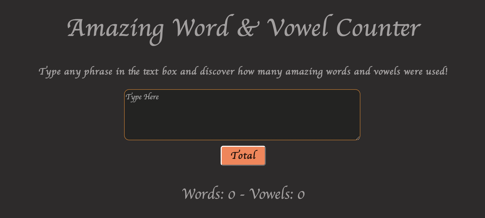

# Vanilla Javascript Word and Vowel Counting App

_Simple application that takes user text input and returns a vowel and word total_

**Play** it [here](https://nomoneyrecord.github.io/Word-And-Vowel-Count/)

## Summary

This project was a great addition to my tool box for problem solving and creating practical logic with in Javascript. I found myself trying mutliple approaches to generate totals for each result and found that keeping it simple is key to high level development. Though there are many ways to generate a result through the commands, there's a more precise way to command solid results with less noise. Even with counting values in an array can utilize forLoops, inclusions, splits, and even regEx, there's always a more efficient tool for that specific type of command. Yet, in hind sight, I see that I could've easily made a singular function, with simpler logic, and easier readability. This was a great project for me to practice more understanding of the DOM as well as simplyfying and compressing my commands into a more efficient resolution.

## Author 

Gary Hughes Jr - _Full Stack Software Developer_ - [Website](https://garyleehughesjr.com) | [LinkedIn](https://www.linkedin.com/in/gary-hughes-jr-64925b229/)